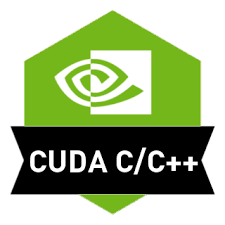
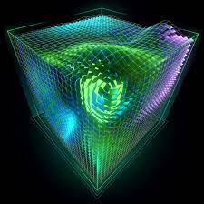

# CUDA Python/C++

 


Matrix Multiplication

```
import numpy
def dot(a, b):
    """Multiply the matrix a with the matrix b.
    
    Parameters
    ----------
    a: ndarray
        left matrxi
    b: ndarray
        right matrix
        
    Return
    ------
    c: ndarray
        result matrix
    """
    c = numpy.zeros((a.shape[0], b.shape[1]))
    for i in range(a.shape[0]):
        for j in range(b.shape[1]):
            for k in range(a.shape[1]):
                c[i, j] += a [i, k] * b[k, j]
    return c

```
Let's two small matrices and see how long the above function takes to conpute matrix multiplication.
```
n = 256
a = numpy.random.random((n, n))
b = numpy.random.random((n, n))

t_dot = %timeit -o dot(a, b)
```

A matrix multiplication of two n by n matrices performs 2n^3 operations. The dot function achieves
```
print("%.3f GFLOP/s" % (2e-9 * n**3 / t_dot.best))
```

That's why they tell is Python is slower.

Luckily, we have Numba, an open source JIT compiler that translates a subset of Python and NumPy code into fast machine code.

Numba makes Python code fast.
```
from numba import jit
jdot = jit(dot)

t_jit = %timeit -o jdot(a, b)

print("%.3f GFLOP/s" % (2e-9 * n**3 / t_jit.best))
```